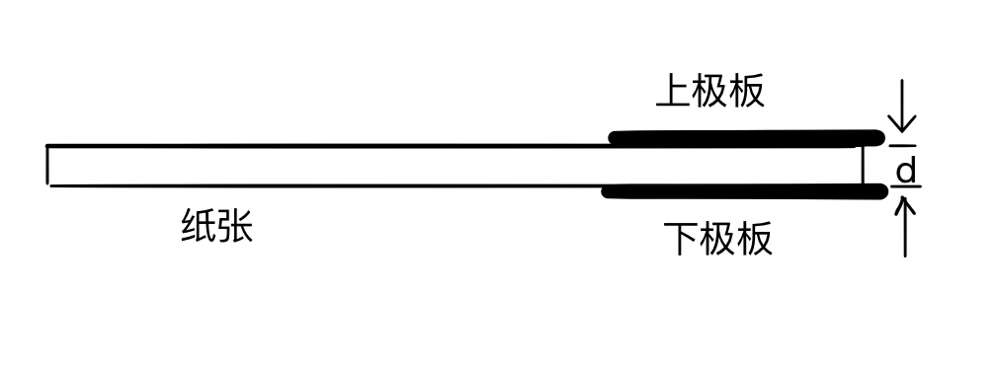
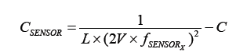
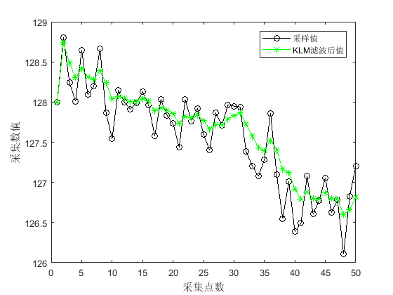
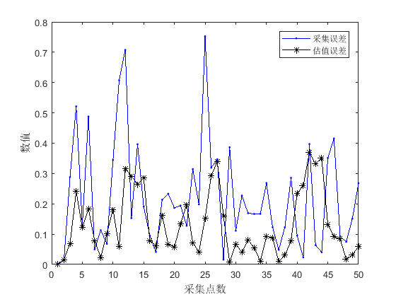
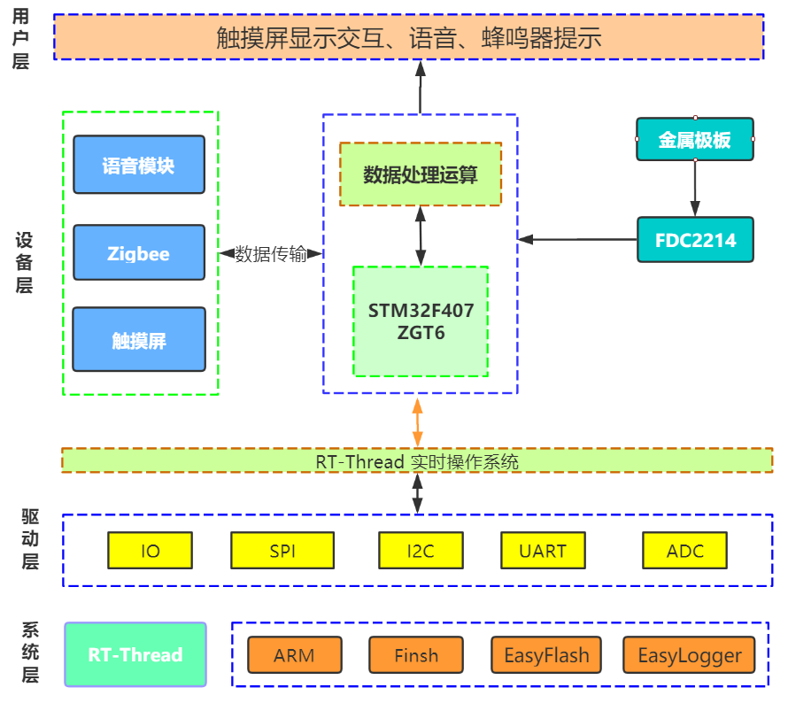
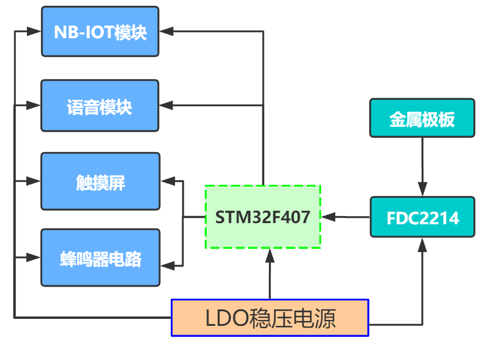

2019年全国大学生电子设计竞赛

**纸张计数显示装置（F题）**

**【本科组】**

**JD046**

**2019年8月10日**

**摘 要**

纸张计数显示装置基于RT-Thread实时操作系统，硬件平台采用STM32F407单片机为主控制器，以具有抗电磁干扰（EMI）架构的FDC2214模块作为电容采集传感器，通过屏蔽双绞线连接至两铜极板，读取采集的数据并进行相应判断，应用触摸屏和语音模块进行状态显示与播报。FDC2214模块将采集到的数据通过IIC协议传输给主控制器，主控制器对原始数据进行卡尔曼滤波，抑制噪声对数据采集的影响。校准模式下，本系统利用最大隶属度法，确定电容模拟值及纸张数的论域，定义模糊子集和隶属函数，建立模糊规则控制表，求得模糊控制查询表。其根据采集到的两极板的数据，做出短路判断并读取多组实时数据，将其与模拟区间进行归类，选取最大可能性区间作为期望值，减小最终判断的差错率。

**关键字：** FDC2214 卡尔曼滤波 模糊算法 RT-Thread STM32

**Abstract**

This system is based on RT-Thread real-time operating system,the hardware
platform adopts STM32F407 microcontroller as the main controller,and FDC2214
module with anti-electromagnetic interference architecture as the capacitor
acquisition sensor.The FDC2214 module is connected to the two metal plates
through the shielded twisted pair,the collected data is sent back from the metal
plates to FDC2214 module,after being calculated,we use touch serial port screen
and voice module for state display and broadcast.FDC2214 module transport
collected data to the main controller through IIC protocol,The main controller
performs kalman filtering on the original data to reduce the influence of noise
on data collection.In the calibration mode, the system uses the mean of maximum
method to determine the theoretical domain of capacitance analog value and paper
number,define the fuzzy subset and membership function,establish the fuzzy rule
control table, and obtain the fuzzy control query table.According to the data
collected from the two metal plates,it makes short-circuit judgment and reads
multiple sets of real-time data,classifies them with the simulation
interval,selects the maximum probability interval as the expected value,and
reduces the error rate of the final judgment.

**Keyword:** FDC2214 Kalman Filtering Fuzzy Algorithm RT-Thread STM32

**目 录**

[1系统方案 1](#系统方案)

[1.1 电容式传感器的论证与选择 1](#电容式传感器的论证与选择)

[1.2 压力式结构的论证与选择 1](#压力式结构的论证与选择)

[1.3 控制系统模块的论证与选择 2](#控制系统模块的论证与选择)

[2系统理论分析与计算 2](#系统理论分析与计算)

[2.1 测量原理分析计算 2](#测量原理分析计算)

[2.1.1 创建模型：模拟平行极板电容器 2](#创建模型模拟平行极板电容器)

[2.1.2 FDC2214电容感测原理 3](#fdc2214电容感测原理)

[2.2 抗干扰分析 4](#抗干扰分析)

[2.2.1 卡尔曼滤波器 4](#卡尔曼滤波器)

[2.2.2 模糊算法 5](#模糊算法)

[2.3 误差分析 5](#误差分析)

[2.3.1 极板间充电效应 5](#极板间充电效应)

[2.3.2 不同环境下的电磁干扰 5](#不同环境下的电磁干扰)

[3电路与程序设计 6](#电路与程序设计)

[3.1电路的设计 6](#电路的设计)

[3.1.1系统总体框图 6](#系统总体框图)

[3.1.2 硬件电路整体框图 6](#硬件电路整体框图)

[3.2程序的设计 7](#程序的设计)

[3.2.1程序功能描述与设计思路 7](#程序功能描述与设计思路)

[3.2.2程序流程图 7](#程序流程图)

[4测试方案与测试结果 7](#测试方案与测试结果)

[4.1测试方案 7](#测试方案)

[4.2 测试条件与仪器 8](#测试条件与仪器)

[4.3 测试结果及分析 8](#测试结果及分析)

[4.3.1测试数据分析 8](#测试数据分析)

[4.3.2测试结果 9](#测试结果)

[4.3.3测试分析与结论 9](#测试分析与结论)

[5 创新特色总结展望 9](#创新特色总结展望)

[6.参考文献 9](#参考文献)

[附录1：电路原理图 10](#附录1电路原理图)

[附录2：源程序 10](#附录2源程序)

**纸张计数显示装置（F题）**

**【本科组】**

1系统方案
=========

本系统主要由电容式传感器模块、机械结构、控制系统组成，下面分别论证这几个模块的选择。

1.1 电容式传感器的论证与选择
----------------------------

方案一：基于NE555时基电路的电容式传感器测量电路。由电容式传感器和NE555实际电路构成多谐振荡器，将电容转化为频率，使电容的极距与频率形成正比，在通过F/V频率转换器转换成电压，由减法器输出与极板位移相应的电压。

方案二：FDC2214电容数字转换器。FDC2214采用创新型抗EMI架构，具有28位分辨率，4.08ksps高输出速率，可对噪声和干扰进行高度抑制。具有低功耗，4通道的接触式感测技术，支持宽激励频率范围，可为系统设计带来灵活性。

考虑题目对测量精度的要求，电容式传感器应用灵敏度的主要限制因素在于传感器的噪声敏感性，
FDC2214采用创新型EMI架构，即使在高噪声环境中也能维持性能不变。综合考虑采用方案二。

1.2 压力式结构的论证与选择
--------------------------

方案一：重物压力式结构。如图1-1所示，利用重物，尽可能消除铜板和纸张间以及纸张之间的缝隙，并保证纸张厚度的统一，但该结构稳定性较差，对重物的摆放位置和模板的平衡性要求较高。

**图1-1 重物压力式结构示意图**

方案二：导轨式平压式结构。如图1-2所示，该结构确保每次纸张数量时以相同的结构特征进行数据采集，有利于对数据进行特征分析，并进行理论可行性的的论证，但是由于需要外接信号线导致平板高低不平，故而系统稳定性较差。

**图1-2 导轨平压式结构示意图**

方案三：
固定铰链式抗干扰结构。如图1-3所示，通过拉动机械臂移动上极板，利用斜拉球缓冲垂直方向上的正压力，保证每次校验和测试时极板两侧压力相同，增加系统稳定性和测量上限。

**图1-3 固定铰链式抗干扰结构示意图**

考虑到上下极板每次放置需要垂直正对，由于机械臂的位置固定，极板位置偏移量小，辅以斜拉球缓冲，综合考虑采用方案三。

1.3 控制系统模块的论证与选择
----------------------------

方案一：选用AT89C51作为主控制器。AT89C51为8位单片机，数据处理能力明显不足。

方案二：TI公司的MSP430系列微控制器。MSP430单片机具有低功耗的特点，但相较于32位单片机的接口外设及内存资源较少

方案三：STM32系列微控制器。高性能、外设接口及内存资源丰富，用户基数大，资料相对较多。

本系统的需采集的数据样本较为庞大，综合考虑采用方案三。

2系统理论分析与计算
===================

2.1 测量原理分析计算 
---------------------

###  创建模型：模拟平行极板电容器

本装置利用两个平行极板模拟平行极板电容器，装置结构简图如图2-1所示：

**图2-1 平行极板装置示意图**

平板电容器的电容为

（式2-1）

上下极板之间紧夹被测纸张，待测纸张厚度等于上下极板间距离d，极板面积S和相对介电常数保持不变，=8.85，改变极板间待测纸张的数量，电容C边随之变化。

###  FDC2214电容感测原理

FDC2214是基于LC谐振电路原理的一个电容检测传感器，其模块模块原理图如图2-2所示。

**图2-2 FDC2214传感模块电路**

在芯片每个检测通道的输入端连接一个电感和电容，组成LC电路。典型选择是18uH屏蔽SMD电感与33pF电容并联。被测电容传感端与LC电路相连接，将产生一个振荡频率，根据频率值可计算出被测电容值。

FDC2214传感器频率表示为：

（式2-1）

其中：DATAx：DATA_CHx寄存器的转换结果；

fREFX：通道x的参考频率；

FDC2214的数据输出（DATAx）表示为：

（式2-2）

FDC2214传感器测量的传感电容表示为：

（式2-3）

改变极板间距，导致极板间的电容值发生了变化，从而引起LC电路振荡频率的变化，根据频率值可知平行极板之间的传感器原始数据。

2.2 抗干扰分析 
---------------

###  卡尔曼滤波器

**图2-3 卡尔曼滤波器**

卡尔曼滤波器是一个“optimal recursive data processing
algorithm”（最优化自回归数据处理算法）。卡尔曼滤波器通过对过程状态进行估计，卡尔曼滤波器可以分为时间更新和测量更新两个部分：时间更新部分负责向前推算当前的状态变量和误差协方差的估计值，构造下一个时间状态的先验估计；测量更新部分负责信息反馈，用先验估计和新的测量变量构造新的后验估计。

**图2-4 采样数据与KLM滤波数据对比图 图2-5 采样误差与KLM估计误差对比图**

由图2-3的测试结果可知，在测试过程中，主控制器采集到的数值波动较大，排除外部可能造成的干扰，系统本身的采样过程中引入了白噪声，这里通过卡尔曼滤波除去信号中的噪声干扰。

在一个周期内对系统采样50次，将其中一组数据经过卡尔曼滤波后可以看到估计值相较原始数据，波动更小，数据更加平顺。

由图2-4的测试结果可知，在纸张数量一定的情况下，计算在理想情况下（无噪声干扰）的理论真值，以理论真值为参照，比较采集值与经过滤波后的估值与真值的误差，可以看到经过过卡尔曼滤波后的数据误差更小。

### 2.2.2 模糊算法

模糊推理算法是指通过对现实对象的分析，处理数据并构建模糊数学模型。模糊算法是逐次求精的过程。

**图2-5 模糊控制系统组成**

在模糊控制中有多重解模糊的方式：面积平分法、加权平均法（重心法）、平均最大隶属度法等。根据系统的特性，我们选用平均最大隶属度法进行解模糊运算。

最大隶属度法具有两大原则：

　　第一,穷尽性原则,即对象总体中所有分子都能归类。

　　第二,排它性原则,即对象总体中任何一个分子都不能同时归属于两个或者更多的类。

模糊推理结果为输出论域上的模糊集，通过平均最大隶属度法，取模糊集中具有最大隶属度的所有点的平均值作为去模糊化的结果，由此可得到论域上的精确值。

2.3 误差分析 
-------------

###  极板间充电效应

经过多次试验测试分析，当极板长时间处于未处于短路状态下，电容极板会产生充电效应，导致极板间电容逐渐增大，对传感器原始数据的采集造成影响，如表2-1所示。当纸张页数较高时，影响尤为明显，如表2-2所示。

**表2-1 在20张纸条件下传感器原始数据变化表**

| 充电时间/s     | 0      | 5      | 10     | 15     | 20     | 60     |
|----------------|--------|--------|--------|--------|--------|--------|
| 传感器原始数据 | 424.74 | 424.75 | 424.73 | 424.83 | 424.89 | 424.91 |

**表2-2 在65张纸条件下传感器原始数据变化表**

| 充电时间/s     | 0      | 5      | 10     | 15     | 20     | 60     |
|----------------|--------|--------|--------|--------|--------|--------|
| 传感器原始数据 | 351.94 | 352.10 | 352.17 | 352.32 | 352.41 | 353.21 |

###  不同环境下的电磁干扰

考虑到不同环境下会对装置产生不同的电磁干扰，因此进行多种环境下的测试，测量结果如下。可明显看出不同环境下电磁干扰对采集的原始数据造成干扰。

**表2-3 不同环境下采集的传感器原始数据**

| 页数     | 10      | 15      | 20      | 25      | 30      |
|----------|---------|---------|---------|---------|---------|
| 木质桌面 | 516.824 | 452.027 | 418.502 | 399.327 | 385.927 |
| 水泥地板 | 524.529 | 460.381 | 427.152 | 407.870 | 394.625 |

3电路与程序设计
===============

3.1电路的设计
-------------

### 系统总体框图

**图3-1 系统总体框图**

###  硬件电路整体框图

**图3-2硬件电路整体框图**

3.2程序的设计
-------------

### 程序功能描述与设计思路

（1）系统总体工作流程

软件部分主要分成用户交互设计以及数据处理算法设计，基于RT-Thread实时操作系统，利用系统的线程调度完成各个模块的程序处理，程序流程图如图3-3所示。

（2）程序设计思路

在整体软件中，首先在触摸屏菜单进行人机交互，进入不同的功能调用不同的控制函数与数据处理算法。程序线程调度，主要分为简单任务以及核心算法算法任务。简单任务为IO设备、触摸屏、OLED屏幕、语音模块、NB-IOT模块等设备控制；核心控制算法任务为FDC2214电容模拟值采集、卡尔曼滤波以及模糊求解最大可能性落点区间，从而得到当前纸张数量。

### 3.2.2程序流程图

**图3-3 程序流程图**

4测试方案与测试结果
===================

4.1测试方案
-----------

**图4-1 测试流程图**

4.2 测试条件与仪器
------------------

（1）软件开发环境：Keil5。

（2）配套加工安装条件：3D打印机，激光切割机。

（3）前期自行设计使用模块：主控制器核心控制板。

4.3 测试结果及分析
------------------

### 测试数据分析

(1)
保持测试环境不变，采集50个样本，通过MATLAB拟合出纸张页数与传感器原始数据的曲线关系，如图4-2所示。

**图4-2 纸张页数与模拟量的拟合函数关系图**

(2) 根据(1)中采集的50个样本，确定电容模拟值及纸张数的论域，划分模糊子集，如表4-1
所示。

**表4-1页数与模拟量区间对应表**

| 页数/张 | 对应模拟量区间    | 页数/张 | 对应模拟量区间  |
|---------|-------------------|---------|-----------------|
| 1       | [1680.00,1345.34] | 6       | [682.48,633.84] |
| 2       | [1345.34,1013.26] | 7       | [633.84,598.03] |
| 3       | [1013.26,845.12]  | 8       | [598.03,569.46] |
| 4       | [845.12,748.79]   | 9       | [569.46,546.28] |
| 5       | [748.79,682.48]   | 10      | [546.28,529.16] |

(3)
根据（2）中划分的模糊子集，保持测试环境不变，固定测量35张纸张，采集数据如表4-2所示，采集到的原始数据90%落入35张页数所对应的区间[401.35,399.50]，如图4-3所示。

**表4-2 纸张数为35的实时数据**

| 测试组别 | 原始数据 | 测试组别 | 原始数据 |
|----------|----------|----------|----------|
| 1        | 400.896  | 6        | 400.824  |
| 2        | 401.049  | 7        | 400.591  |
| 3        | 400.157  | 8        | 401.111  |
| 4        | 399.912  | 9        | 400.443  |
| 5        | 401.125  | 10       | 398.529  |

>   **图4-3 纸张数为35的分布区间图**

(4)
根据（2）中划分的模糊子集，保持测试环境不变，固定测量46张纸张，采集数据如表4-3所示，模拟值大部分落入46张页数所对应的区间[383.6,382.7]，如图4-4所示。

**表4-3纸张数为46的实时数据**

| 测试组别 | 原始数据 | 测试组别 | 原始数据 |
|----------|----------|----------|----------|
| 1        | 383.1243 | 6        | 385.6523 |
| 2        | 383.7841 | 7        | 382.9651 |
| 3        | 384.1236 | 8        | 382.2015 |
| 4        | 384.3164 | 9        | 383.7621 |
| 5        | 383.9984 | 10       | 384.1343 |

**图4-4 纸张数为46的分布区间图**

### 4.3.2测试结果

**表4-4 工作模式下纸张测试结果表**

| 范围   | 测试次数 | 正确次数 | 正确率 |
|--------|----------|----------|--------|
| 1\~10  | 25       | 25       | 100%   |
| 11\~20 | 25       | 25       | 100%   |
| 20\~30 | 25       | 25       | 100%   |
| 30\~40 | 25       | 25       | 100%   |
| 40\~50 | 25       | 25       | 100%   |
| 50\~60 | 25       | 23       | 92%    |
| 60\~70 | 25       | 20       | 80%    |
| 70\~80 | 25       | 16       | 64%    |

### 4.3.3测试分析与结论

根据上述测试数据可知，采集到的原始数据与纸张数大致呈幂函数关系，通过划分模糊子集，修改模糊规则控制表，确定每个区间的隶属度，可推算出当前的纸张数量。

经测试，该系统可实现题设要求的全部功能，且误差在题目要求范围之内。

5 创新特色总结展望 
===================

本系统在完成了题目要求的同时，还增加触摸屏进行人机交互，具有十分友善的GUI，并增加了语音提示功能。系统的稳定测量源于机械结构的创新特性，采用固定铰链式抗干扰结构，确保上下极面的正对面积保持不变。整个系统的构建源于机械结构、电路设计、软件设计的合理架构，最大亮点是基于RT-Thread实时操作系统进行线程调度，极大程度的利用了MCU的资源，使得系统响应快、稳定性高。此外，基于电容检测的特性，增加了扩展功能以适应一些生活应用场景，例如：打印机剩余纸张检测，当纸张数量小于一定数量，报警提示用户；材料识别，预先采集材料阈值，进行不同材料的区分；纸币识别，识别不同纸币的面额。

6.参考文献 
===========

| [1]德州仪器半导体技术（上海）有限公司. 德州仪器高性能模拟器件高校应用指南.德州仪器半导体技术（上海）有限公司大学计划, 2014.
|---------------------------------------------------------------------------------------------------------------------------------------------------------------------------|

| [2]彭丁聪.卡尔曼滤波的基本原理及应用[J].软件导刊,2009,8(11):32-34. 
|---------------------------------------------------------------------------------------------------------------------------------------------------------------------------|

| [3]刘尧,邱运鹏,裴成梅,汪晨阳,胡安正.基于FDC2214电容式传感器的手势识别装置[J]. 电子制作,2019(10):13-15. |
|---------------------------------------------------------------------------------------------------------------------------------------------------------------------------|

附录1：电路原理图
=================

==========================================

附录2：源程序
=============

核心函数：计算最大可能落点，返回纸张页数

