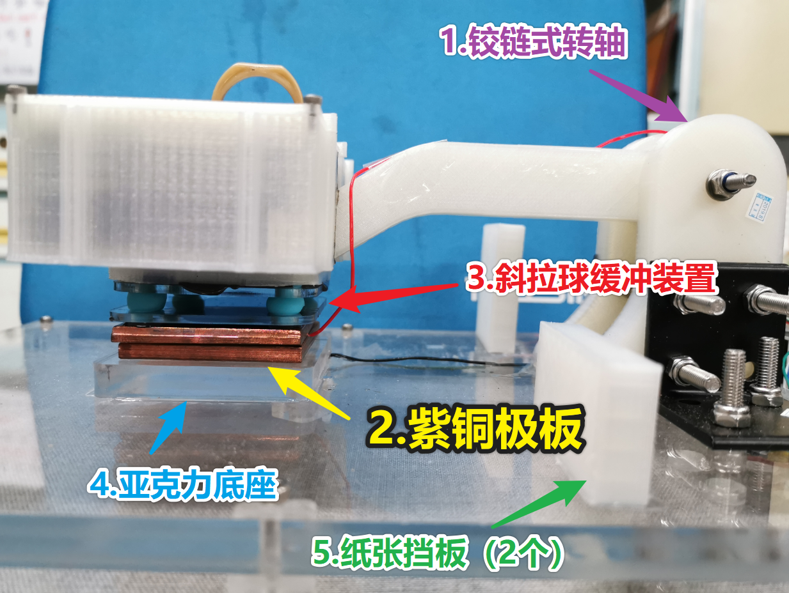
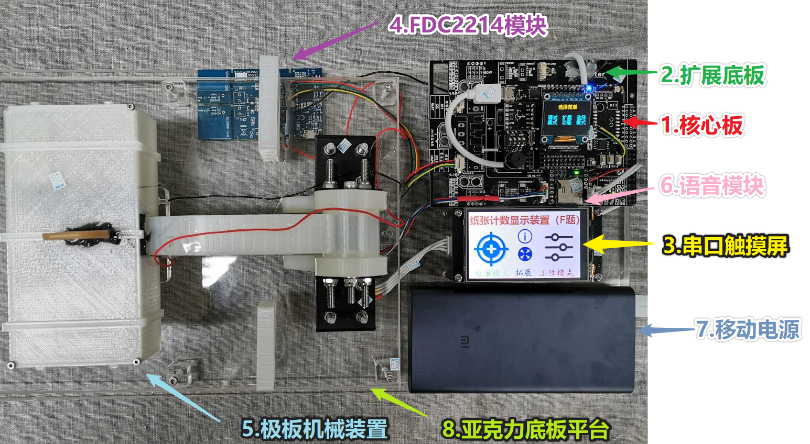

方案一：重物压力式结构。如图1-1所示，利用重物，尽可能消除铜板和纸张间以及纸张之间的缝隙，并保证纸张厚度的统一，但该结构稳定性较差，对重物的摆放位置和模板的平衡性要求较高。

**图1-1 重物压力式结构示意图**

方案二：导轨式平压式结构。如图1-2所示，该结构确保每次纸张数量时以相同的结构特征进行数据采集，有利于对数据进行特征分析，并进行理论可行性的的论证，但是由于需要外接信号线导致平板高低不平，故而系统稳定性较差。

**图1-2 导轨平压式结构示意图**

方案三：
固定铰链式抗干扰结构。如图1-3所示，通过拉动机械臂移动上极板，利用斜拉球缓冲垂直方向上的正压力，保证每次校验和测试时极板两侧压力相同，增加系统稳定性和测量上限。

**图1-3 固定铰链式抗干扰结构示意图**

考虑到上下极板每次放置需要垂直正对，由于机械臂的位置固定，极板位置偏移量小，辅以斜拉球缓冲，综合考虑采用方案三。

- 整体实物图
